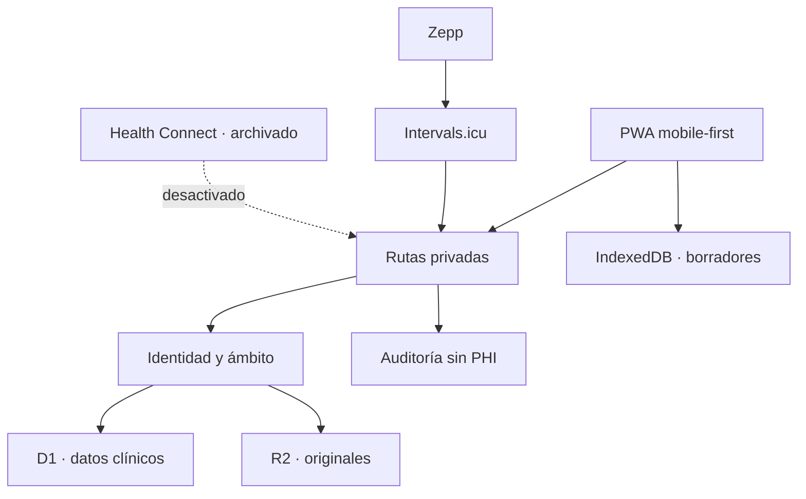

# Arquitectura de Entheos

Versión de referencia: 2026-08-24.

## Principios

1. **Privado por defecto.** No existe registro público ni listado de usuarios.
2. **Aislamiento explícito.** Toda entidad clínica pertenece a una organización y un paciente.
3. **Fuente antes que inferencia.** Paciente, documento, profesional e IA se conservan diferenciados.
4. **Original inmutable.** Un archivo cargado se conserva por hash y versión; los datos derivados viven aparte.
5. **IA desactivada en la experiencia actual.** La arquitectura conserva trazabilidad para una etapa futura, pero la interfaz no genera ni propone interpretaciones clínicas.
6. **Migraciones aditivas.** El esquema previo permanece disponible hasta verificar la importación.
7. **Offline acotado.** El dispositivo puede retener borradores; no se convierte en autoridad de sesión o datos.

## Capas

- **UI:** Next/Vinext y React, sin dependencias gráficas externas.
- **Servidor:** rutas dinámicas ejecutadas en Cloudflare Workers.
- **Identidad:** encabezados autenticados `oai-authenticated-user-*`, inyectados por la plataforma.
- **Persistencia:** D1 para datos estructurados y R2 para binarios.
- **Cliente:** IndexedDB para cola idempotente y última vista; `localStorage` sólo para tema.

## Flujo de autorización

1. La portada exige una identidad de ChatGPT mediante `requireChatGPTUser`.
2. La primera solicitud crea de manera determinística usuario, organización personal, membresía y perfil.
3. Cada ruta llama `authorizeClinicalRequest`.
4. Las consultas incluyen simultáneamente `organization_id` y `patient_id`.
5. Los documentos se resuelven por id **y** por ámbito antes de consultar R2.
6. Los tokens técnicos sólo contienen scopes de lectura, vencen y pueden revocarse.

La identidad de la plataforma es la única que puede escribir desde la interfaz. Los tokens Bearer no sustituyen OAuth para una integración privada con ChatGPT.

## Separación de datos

El modelo está preparado para múltiples organizaciones, pacientes, profesionales y permisos aunque la primera versión habilita sólo el espacio individual del propietario.

Invariantes:

- un `patient_profile` tiene un `owner_user_id`;
- las tablas clínicas incluyen `organization_id` y `patient_id`;
- los identificadores recibidos del cliente nunca bastan para autorizar;
- las bajas son lógicas cuando el modelo lo permite;
- cada dato clínico conserva `source_type` y `verification_status`;
- auditoría almacena acción, entidad e identificador, pero no copia el contenido clínico.

## Documentos

1. Se limita el tamaño a 25 MB.
2. El tipo se verifica por firma mágica o por formato de datos admitido.
3. Se calcula SHA-256 y se rechazan duplicados por paciente.
4. El original se escribe en `patients/{patient_id}/{document_id}/original`.
5. D1 registra referencia, versión, evento y vínculo.
6. Si la escritura estructurada falla, el objeto R2 se elimina.
7. Vista y descarga vuelven a comprobar ámbito y usan `no-store`, `nosniff` y sandbox.

No se admiten HTML, SVG, ejecutables ni documentos activos.

## Línea de tiempo y procedencia

Mediciones, síntomas, documentos, notas, consultas y revisiones se proyectan en `timeline_events`. El evento conserva fecha clínica (`effective_at`), fecha de registro (`recorded_at`), fuente, verificación, relevancia, etiquetas y versión.

Los hechos clínicos estructurados —condiciones referidas, medicación, alergias, antecedentes familiares, hábitos y tratamientos— viven en `clinical_facts` y se vinculan por `source_id` con su evento.

## Capacidad reservada de IA

`ai_suggestions` permanece en el modelo para una etapa futura, pero sus rutas no se ofrecen en la interfaz actual. Si se reactiva, deberá conservar revisión humana explícita, procedencia y separación respecto de los datos confirmados.

## Integraciones

- `GET /api/v1/patient-summary`: resumen autorizado y compacto.
- `POST /mcp`: transporte HTTP stateless con `search`, `fetch`, resumen, últimas mediciones y cambios desde cursor.
- Tokens: hashes SHA-256, lectura únicamente, vencimiento de 30 días, revocación y registro de último uso.
- `integration_connections`: ciclo de vida aislado por proveedor, usuario y paciente (`pending_pairing`, `active`, `degraded`, `interrupted`, `revoked`).
- Intervals.icu: OAuth 2.0 por persona y scopes `ACTIVITY:READ` y `WELLNESS:READ`; el secreto de la aplicación permanece en el servidor y el token de cada atleta se cifra con AES-GCM antes de guardarse.
- Sincronización: consultas fechadas de hasta 366 días, identificadores determinísticos por fuente y referencia externa, y actualizaciones idempotentes para observaciones, sueño, peso, presión y actividad.
- Revocación: invalida el token y el consentimiento de la conexión sin borrar el historial ya recibido.

El desarrollo de Health Connect, su APK, rutas y pruebas permanece en el repositorio como conector experimental. No se anuncia ni se inicia desde la interfaz pública; podrá reactivarse mediante una decisión posterior sin reconstruirlo.

El MCP usa OAuth 2.1 con autorización por usuario. Los tokens técnicos de lectura y los tokens de conectores nativos tienen ámbitos y tablas separados.

## PWA y modo sin conexión

El service worker sólo cachea manifest e iconos. Navegaciones, HTML, autenticación y `/api` permanecen network-only. IndexedDB contiene:

- `cache/overview:{identity_hash}`: última vista privada separada por identidad;
- `outbox`: escrituras POST con hash de identidad y UUID usado como clave de idempotencia.

Al recuperar conexión, la cola se procesa en orden. El servidor registra la clave en `sync_events` para impedir repeticiones.

## Migración

Las tablas heredadas se conservan exclusivamente para una migración única. Una sesión anterior válida y la confirmación de su contraseña permiten leer el JSON legado y transformarlo a plan, días, comidas y mediciones. La fecha inicial se toma del payload original; no se reemplaza por la fecha actual. `sync_events` impide importar el mismo perfil dos veces.

## Límites conocidos

- La activación multiusuario de Intervals.icu requiere que el proveedor registre previamente Entheos como aplicación OAuth.
- La integración Zepp–Intervals.icu confirma actividades, pasos, sueño y frecuencia cardíaca en reposo; otras métricas dependen de lo que Zepp entregue a ese servicio.
- El bienestar puede demorarse hasta que Intervals.icu complete su propia lectura desde Zepp.
- No existe recuperación independiente de identidad dentro de la app; depende de la cuenta ChatGPT.
- Los documentos binarios se respaldan por separado del JSON estructurado.
- No hay interpretación médica automática ni alertas diagnósticas.
