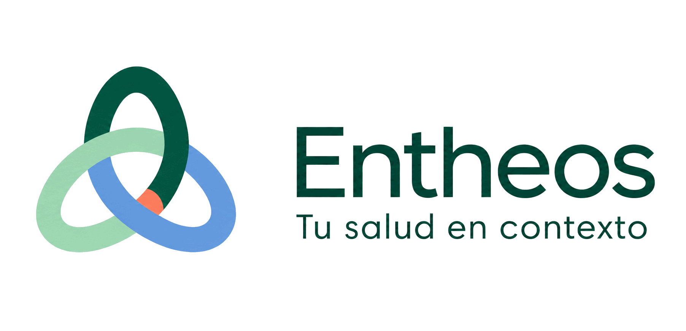

<p align="center">
  
</p>

<p align="center">
  Historia personal de salud, hábitos, documentos e integraciones en un único contexto.
</p>

<p align="center">
  <a href="https://seguimiento-nutricional-marcelo.arielmarcelogomez7.chatgpt.site"><strong>Abrir la aplicación</strong></a>
  ·
  <a href="docs/USER_GUIDE.md">Guía de uso</a>
  ·
  <a href="docs/TECHNICAL_GUIDE.md">Guía técnica</a>
</p>

## Qué es Entheos

Entheos es una aplicación web mobile-first para reunir mediciones, hábitos, síntomas, antecedentes, laboratorios, documentos y seguimiento nutricional en una línea de tiempo con procedencia visible.

La aplicación no cuenta calorías, no diagnostica, no interpreta estudios como sustituto profesional y no transforma automáticamente observaciones en conclusiones clínicas.

**Estado:** beta pública con acceso autenticado mediante una cuenta de ChatGPT. Cada persona obtiene un espacio separado; no existe un listado público de usuarios ni se publican sus datos.

## Funciones principales

- Registro de peso, presión arterial, pulso, actividad, sueño, síntomas, alimentación y notas.
- Historia completa en tabla, con búsqueda, filtros por fecha y tipo, paginación y exportación.
- Perfil clínico, antecedentes, medicación y alergias con alta, edición y baja lógica.
- Laboratorios con últimos valores, rangos informados, historial y minigráficos de tendencia.
- Biblioteca de documentos y estudios con originales versionados.
- Informes A4, CSV, JSON, Markdown y restauración con vista previa.
- PWA instalable, modo claro predeterminado y modo oscuro opcional.
- Integración OAuth de sólo lectura con Intervals.icu.
- Arquitectura preparada para incorporar nuevas fuentes sin mezclar procedencias.

El desarrollo de Health Connect se conserva como conector experimental en [`android/entheos-bridge`](android/entheos-bridge/README.md), pero está oculto en la experiencia pública mientras no alcance la estabilidad requerida.

## Arquitectura

| Capa | Tecnología | Responsabilidad |
|---|---|---|
| Interfaz | React, Next/Vinext, TypeScript | PWA responsive y accesible |
| Ejecución | Cloudflare Workers | Rutas autenticadas y APIs |
| Datos | D1 + Drizzle ORM | Historia estructurada y auditoría |
| Documentos | R2 | Originales privados y versionados |
| Dispositivo | IndexedDB | Borradores y cola idempotente |
| Identidad | ChatGPT / Sites | Sesión y separación por usuario |

Más información en [Arquitectura](ARCHITECTURE.md), [Modelo de datos](docs/DATA_MODEL.md) y [Modelo de amenazas](docs/THREAT_MODEL.md).

## Desarrollo local

Requisitos:

- Node.js 24 o superior.
- Linux o un entorno compatible con GNU `timeout` y `flock`.

```bash
npm run install:ci
npm run dev
```

Verificación completa:

```bash
npm run lint
npm run typecheck
npm test
```

El archivo `.openai/hosting.json` incluido usa nombres genéricos para los bindings locales. El despliegue real necesita una base D1, un bucket R2, identidad autenticada y variables privadas configuradas en el entorno.

## Variables privadas

Copiá `.env.example` sólo como referencia. Nunca confirmes valores reales en Git:

```text
APP_OWNER_EMAIL
INTERVALS_CLIENT_ID
INTERVALS_CLIENT_SECRET
ENTHEOS_INTEGRATION_KEY
```

Las claves de firma Android, tokens OAuth, respaldos, documentos clínicos y bases locales quedan expresamente excluidos del repositorio.

## Integraciones

### Intervals.icu

Conector principal mediante OAuth 2.0, scopes mínimos de actividad y bienestar, token cifrado en servidor, sincronización por períodos y deduplicación determinística.

### Zepp

Zepp puede enviar parte de su información a Intervals.icu. Entheos conserva la fuente original informada y permite volver a sincronizar períodos sin duplicar registros.

### Health Connect

El código experimental permanece disponible para investigación, pero no forma parte del recorrido público ni de las versiones firmadas distribuidas actualmente.

## Seguridad y privacidad

- Toda consulta clínica se filtra por organización y paciente.
- Las APIs, sesiones y páginas autenticadas usan `no-store`.
- Los documentos se validan por formato, tamaño, hash y ámbito antes de guardarse o descargarse.
- Los secretos de proveedores permanecen en el servidor.
- El service worker no intercepta autenticación, HTML ni rutas clínicas.
- Este repositorio contiene únicamente datos ficticios de ejemplo.

Revisá el [checklist de seguridad](docs/SECURITY_CHECKLIST.md) y la [revisión técnica](docs/SECURITY_REVIEW.md).

## Identidad de marca

El kit oficial —miniatura, firma completa, símbolo aislado y versión artística— está disponible en [`docs/brand`](docs/brand).

## Autor

Diseñado y desarrollado por [Ariel Marcelo Gómez](https://github.com/sinergiaestudio).

## Derechos

Copyright © 2026 Ariel Marcelo Gómez. Código fuente publicado para evaluación y desarrollo del proyecto. No se concede una licencia de reutilización, redistribución o explotación comercial salvo autorización expresa.
