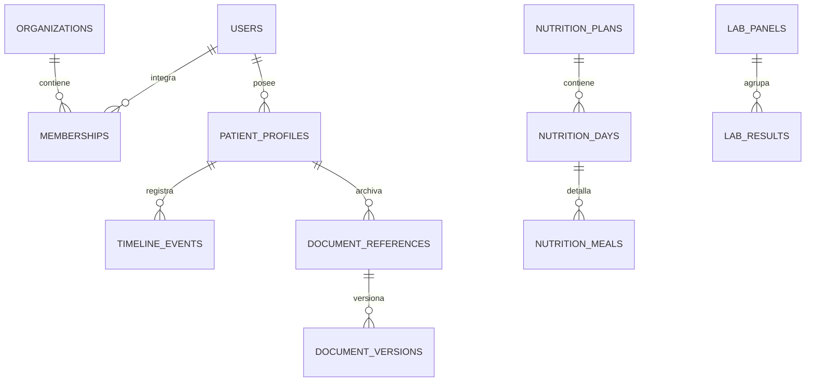

# Modelo de datos

## Identidad y tenencia

| Tabla | Propósito | Claves de aislamiento |
|---|---|---|
| `users` | Identidad de plataforma | correo único |
| `organizations` | Límite de tenencia | `id` |
| `memberships` | Rol dentro de una organización | organización + usuario |
| `patient_profiles` | Ficha principal del paciente | organización + propietario |
| `care_team` | Profesionales vinculables | organización + paciente |
| `access_grants` | Permisos futuros por módulo | organización + paciente |

La versión inicial crea una organización individual y una membresía `patient_admin`. El esquema no depende de ese supuesto para futuras organizaciones familiares o clínicas.

## Historia clínica

| Tabla | Contenido |
|---|---|
| `timeline_events` | Secuencia unificada con fecha clínica, fuente, verificación y versión |
| `clinical_facts` | Condiciones referidas, medicación, alergias, antecedentes, hábitos y tratamientos |
| `encounters` | Consultas y episodios futuros |
| `observations` | Observaciones extensibles por tipo de medición |
| `notes` | Notas privadas o compartibles |
| `tasks`, `reminders` | Seguimientos y recordatorios futuros |

`source_type` distingue `patient`, `document`, `professional`, `device`, `legacy` y `ai`. `verification_status` puede expresar `declared`, `pending`, `imported`, `patient_confirmed` o `professional_confirmed`.

## Mediciones y hábitos

- `weight_entries`: peso, cintura, IMC calculado sólo cuando hay altura y condiciones de medición.
- `blood_pressure_readings`: tomas individuales agrupables por `series_id`; el promedio no implica interpretación.
- `activity_sessions`: tipo, duración, distancia, frecuencia cardíaca opcional, esfuerzo y recuperación.
- `sleep_entries`: referencia temporal, horarios, duración, calidad, despertares y notas.
- `symptom_entries`: descripción, zona, intensidad, frecuencia, desencadenantes y estado.
- `measurement_types`: catálogo extensible para observaciones adicionales.

## Documentos y laboratorio

- `document_references`: metadatos y clave R2 del original.
- `document_versions`: versiones inmutables con hash y tamaño.
- `document_event_links`: relación entre documento y línea de tiempo.
- `lab_panels`: cabecera del estudio, institución y estado.
- `lab_results`: analito, valor informado, valor numérico opcional, unidad, rango del informe, método y bandera original.

La unidad y el rango pertenecen al informe fuente; la aplicación no aplica rangos universales.

## Nutrición

- `nutrition_plans`: plan, período, profesional, objetivos, fuente y versión.
- `nutrition_days`: hidratación, sueño, energía, hambre/ansiedad, digestión, adherencia y observaciones.
- `nutrition_meals`: seis bloques habituales, estado, estructura P/H/V, alimentos y notas.

La adherencia usa: cumplido 1; parcial o reemplazado 0,7; no realizado 0. Sólo se promedian bloques registrados.

## IA, sincronización y auditoría

- `ai_suggestions`: propuesta, modelo opcional, confianza opcional y resolución humana.
- `api_tokens`: sólo hash, scopes, vencimiento, último uso y revocación.
- `sync_events`: idempotencia de cola offline, migración y restauración.
- `audit_logs`: quién, acción, entidad, resultado y metadatos mínimos no clínicos.
- `consent_records`: base para consentimientos versionados futuros.

## Reglas de versionado y borrado

- Documentos originales nunca se sobrescriben.
- Eventos y hechos incluyen versión y posibilidad de `supersedes_id`.
- Las entidades clínicas principales incluyen `deleted_at` para baja lógica.
- Una corrección no debe destruir el valor o documento fuente.
- Los logs de auditoría son append-only desde la aplicación.

## Relaciones principales

Todas las relaciones clínicas se restringen además por organización y paciente en la capa de acceso.
